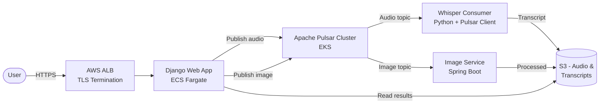
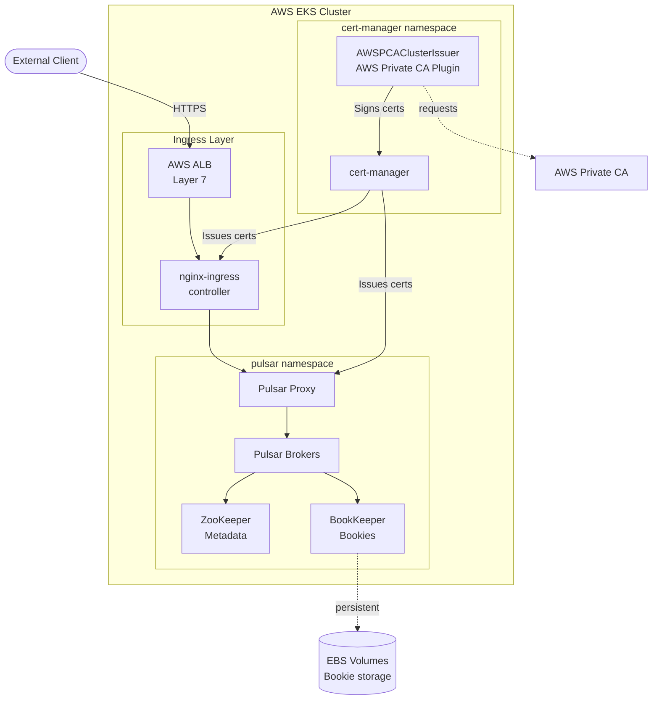
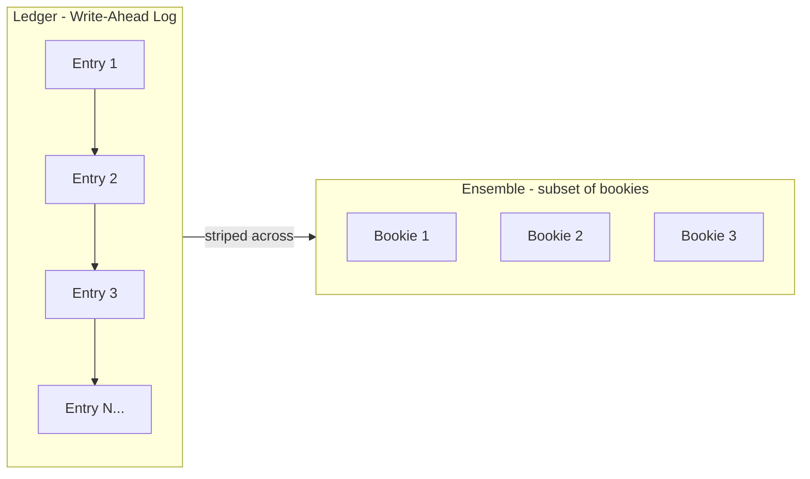
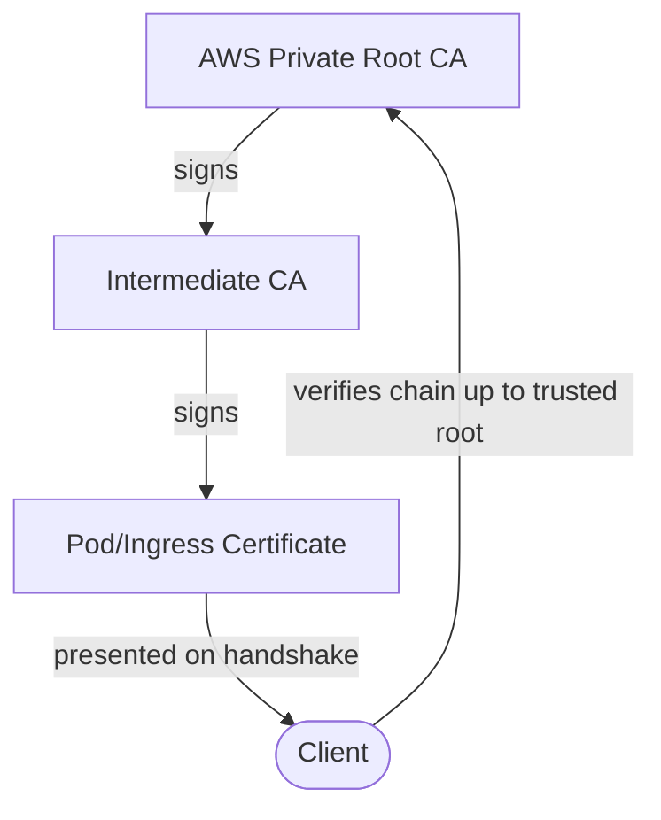
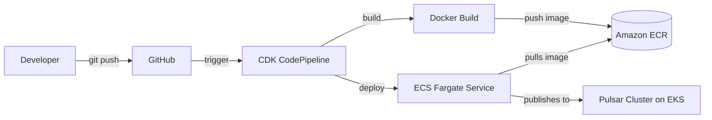

# BabbleBox

**Where conversations keep evolving.** An async audio chat platform with AI-powered transcription, deployed on AWS with a production-grade Kubernetes and Pulsar setup.

> **Status:** Work in progress — this repo is a learning project exploring distributed messaging, Kubernetes, and AWS infrastructure end-to-end.

---

## What It Does

BabbleBox is an **asynchronous audio chat app** for people who want meaningful conversations without the pressure of responding in real time. Record a voice message, send it to a friend, and they reply when they're ready. In the background, AI enhances the audio and transcribes it.

**Features**

- 🎙️ **Async voice messaging** — record and send audio without waiting for the other person
- 📝 **AI transcription** — powered by OpenAI Whisper, runs as a separate consumer service
- 🖼️ **Image generation** — a Spring Boot microservice handles image processing
- 🔒 **End-to-end encrypted** — TLS everywhere, from the browser to inter-service traffic
- 🌍 **Deployed on AWS** — production-grade infrastructure on EKS + ECS Fargate

---

## System Architecture

BabbleBox is a **polyglot microservices platform** orchestrated by [Apache Pulsar](https://pulsar.apache.org/) for async message passing between services. Each service can be developed, deployed, and scaled independently.



### Component Breakdown

| Service | Repo | Tech | Responsibility |
|---|---|---|---|
| **Web app** | [babblebox](https://github.com/shivaam/babblebox) | Django + WebSockets + Traefik | UI, auth, audio upload, routing messages to Pulsar |
| **Transcription** | [whisper-pulsar-consumer](https://github.com/shivaam/whisper-pulsar-consumer) | Python + OpenAI Whisper | Consumes audio topic, transcribes with Whisper, publishes results |
| **Image service** | [babblebox-image-service](https://github.com/shivaam/babblebox-image-service) | Spring Boot | Consumes image topic, handles image processing and generation |
| **Pipeline** | [babblebox-cdk-pipeline](https://github.com/shivaam/babblebox-cdk-pipeline) | AWS CDK + CodePipeline | CI/CD for building and shipping the Django app |
| **Consumer infra** | [whisper-pulsar-consumer-cdk](https://github.com/shivaam/whisper-pulsar-consumer-cdk) | AWS CDK | Infra-as-code for the Whisper consumer |

---

## Kubernetes & Pulsar Setup

The Pulsar cluster runs on **Amazon EKS** with full TLS, cert automation, and Helm-based releases. This was the most interesting part of the project — I went deep on Kubernetes networking, TLS trust chains, and certificate management.

### Cluster Topology



### What's in the Cluster

- **Apache Pulsar** (Helm chart) — ZooKeeper for metadata, BookKeeper bookies for durable storage, brokers for routing
- **nginx-ingress controller** — Layer 7 routing with path-based rules, fronted by an AWS ALB
- **cert-manager** — automates TLS certificate issuance and renewal
- **AWS Private CA Issuer** ([aws-privateca-issuer](https://github.com/cert-manager/aws-privateca-issuer)) — lets cert-manager request certs from AWS Private CA
- **AWS Cloud Provider** — auto-creates ELBs for `Service: LoadBalancer` resources (built into Kubernetes ≥ 1.24)

### BookKeeper Storage Model

BabbleBox's Pulsar uses Apache BookKeeper for durable, replicated storage. Here's how messages are stored:



**Key concepts:**
- **Entry** — the smallest unit of storage (a single message)
- **Ledger** — an append-only sequence of entries (write-ahead log). Entries are written *at most once* and cannot be modified
- **Bookie** — an individual storage server. Stores *fragments* of ledgers, not entire ledgers
- **Ensemble** — the subset of bookies storing a particular ledger. Entries are striped across the ensemble for performance

### TLS & Certificate Trust Chain

End-to-end TLS is handled via cert-manager and AWS Private CA. The trust chain looks like this:



**How it works:**
1. The server presents its certificate + the intermediate chain on TLS handshake
2. The client walks up the chain, verifying each cert was signed by the next
3. Verification terminates when the client finds a CA it trusts (in its trust store)
4. Once trusted, the client uses the cert's public key to negotiate a symmetric key for the session (symmetric crypto is cheaper than asymmetric for bulk data)

Since AWS Private CA's root isn't in default trust stores, clients need it explicitly (e.g., `curl --cacert`).

### Networking Layers

AWS offers two relevant load balancers, used at different layers:

| Load Balancer | OSI Layer | Used For |
|---|---|---|
| **ALB** (Application) | Layer 7 | URL path/header routing, TLS termination, nginx-ingress frontend |
| **NLB** (Network) | Layer 4 | Port-based routing, used by `Service: LoadBalancer` resources |

The nginx-ingress controller sits behind an ALB and inspects HTTP paths to route to the right pod. For direct pod-level services, NLBs are lighter-weight.

---

## Deployment: Django App on ECS Fargate

The Django web app is containerized and deployed to **ECS Fargate** (separate from the EKS cluster) to keep stateful messaging infra isolated from the stateless web tier.



**Deployment steps (historical, what I used to push the first image manually):**

```bash
# Create the ECR repo
aws ecr create-repository --repository-name babblebox

# Log docker into ECR
aws ecr get-login-password --region us-east-1 \
  | docker login --username AWS --password-stdin <acct>.dkr.ecr.us-east-1.amazonaws.com

# Tag and push
docker tag babblebox_production_traefik <acct>.dkr.ecr.us-east-1.amazonaws.com/babblebox
docker push <acct>.dkr.ecr.us-east-1.amazonaws.com/babblebox
```

The [babblebox-cdk-pipeline](https://github.com/shivaam/babblebox-cdk-pipeline) repo now automates all of this via AWS CDK CodePipeline.

---

## What I Learned Building This

- **Kubernetes networking** — ingress controllers vs. services, Layer 4 vs. Layer 7 LBs, how `Service: LoadBalancer` maps to cloud provider ELBs
- **TLS internals** — PKI, trust chains, how private CAs work, the difference between symmetric and asymmetric crypto during a handshake, mTLS
- **cert-manager** — automating cert issuance and renewal across namespaces, `ClusterIssuer` vs. namespaced `Issuer`
- **Apache Pulsar architecture** — the role of ZooKeeper, BookKeeper, and the broker layer; how ensemble striping works
- **Helm for infra** — managing stateful apps like Pulsar via Helm charts, and the challenges of upgrading them safely
- **AWS CDK** — infrastructure as code for pipelines, ECS Fargate services, and ECR

---

## Related Repositories

- [babblebox-cdk-pipeline](https://github.com/shivaam/babblebox-cdk-pipeline) — CDK CodePipeline for the Django app
- [babblebox-image-service](https://github.com/shivaam/babblebox-image-service) — Spring Boot image microservice
- [babblebox-transcription-service](https://github.com/shivaam/babblebox-transcription-service) — Transcription service
- [whisper-pulsar-consumer](https://github.com/shivaam/whisper-pulsar-consumer) — Python Whisper consumer for Pulsar
- [whisper-pulsar-consumer-cdk](https://github.com/shivaam/whisper-pulsar-consumer-cdk) — CDK infrastructure for the consumer

---

## References

- [Failure resiliency in Flipkart Messaging Platform](https://blog.flipkart.tech/failure-resiliency-and-high-availability-in-flipkart-messaging-platform-ba99302e799d)
- [Tuning Apache Pulsar cluster](https://blog.flipkart.tech/tuning-apache-pulsar-cluster-8c7136cd98ec)
- [TLS-enabled Kubernetes with ACM Private CA and Amazon EKS](https://aws.amazon.com/blogs/security/tls-enabled-kubernetes-clusters-with-acm-private-ca-and-amazon-eks-2/)
- [BookKeeper concepts](https://bookkeeper.apache.org/docs/getting-started/concepts/)
- [aws-privateca-issuer for cert-manager](https://github.com/cert-manager/aws-privateca-issuer)
